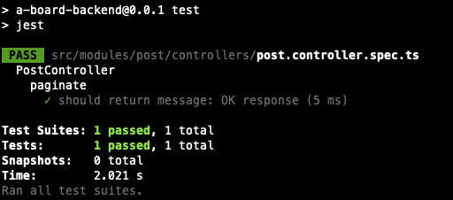
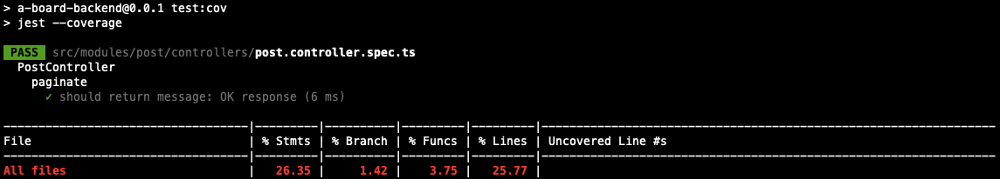
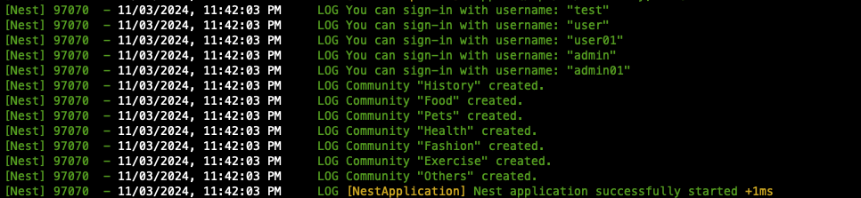

## Description

[Nest](https://github.com/nestjs/nest) framework TypeScript starter repository.

## Installation

```bash
$ npm install
```
## Setup .ENV
you can look .env.example in project
* ENV for development
```
PORT=3100
APP_URL=http://localhost:3000

DATABASE_TYPE=postgres
DATABASE_HOST=localhost
DATABASE_PORT=5432
DATABASE_NAME=YOUR_DATABASE_NAME
DATABASE_USER=YOUR_DATABASE_USER
DATABASE_PASSWORD=YOUR_DATABASE_PASSWORD
DATABASE_SYNC=true

JWT_ACCESS_SECRET=TNkeXPXrplDF1xLena6WEXVBHXcTxKpe
JWT_ACCESS_EXPIRE=30m
JWT_REFRESH_SECRET=yxum8SoPm7oYtToNDd4JGwPJ83ZiJJx3
JWT_REFRESH__EXPIRE=1h

PER_PAGE=10
```
## Test

```bash
# unit tests
$ npm run test

# e2e tests
$ npm run test:e2e

# test coverage
$ npm run test:cov
```
You will see a log like this :


## Running the app

```bash
# development
$ npm run start

# watch mode
$ npm run start:dev

# production mode
$ npm run start:prod
```
After you run the project, you should see a log like this :



#### When your follow top step Open http://localhost:3100/swagger with your browser to see Doc-apis with swagger and you can use the username that appeared in the previous log to sign in.